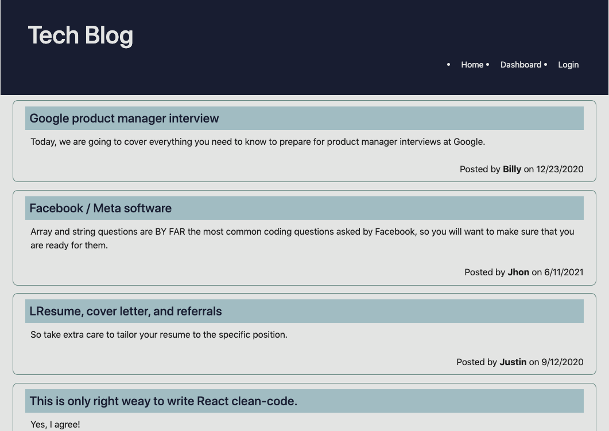

<h1>Tech Blog MVC👋</h1>

## Badges

<br> 

<br>

<br>

<br>

<br>


## Description
🔍 A mysql database and CMS-style Blog built using Model View Controller (MVC) paradigm. Built using MySQL2, Express, Sequelize, Bulma, Handlebars and dotenv.

## Table of Contents
- [Description](#description)
- [Deployment](#application-deployment)
- [Screenshot](#application-screenshot)
- [Installation](#installation)
- [Features](#features)
- [Contributing](#contributing)
- [License](#license)
- [Questions](#questions)

## Application Deployment
[Deployed Site: https://tech-blog-by-xiaojing.herokuapp.com/](https://tech-blog-by-xiaojing.herokuapp.com/)

## Application Screenshot




## Installation
💾 To install the files into your local repo, using Git Bash Terminal:

1) Create a folder locally to nominate for cloning from online repo
2) Clone with SSH by

```GitBash Commands
git clone github.com/xiaojing168jmg168/tech-blog-mvc"
 ```

Additionally, please install [NodeJS](https://nodejs.org/en/) and the below npm packages

```Terminal Commands
npm i init -y
npm i
npm i bcrypt
npm i connect-session-sequelize
npm i dotenv
npm i express
npm i express-handlebars
npm i express-session
npm i handlebars
npm i inquirer
npm i mysql2
npm i nodemon
npm i sequelize
 ```

 Before you run the code, please change scripts:{start: } to 'node server.js' in the package.json file and change your database login credentials in the .env file.
     

## Features
- Posts are viewable and you can see the author and date of the post created.
- You can freely Login and Sign Up to create new posts.
- All posts made by the author are editable and can be deleted.
- Logged in users can leave comments.


## Contributing
👥 Xiaojing Deng


## License

</br>
<p>Permission to use this application is granted under the MIT license.</p>
 
[MIT](https://choosealicense.com/licenses/mit)


## Questions
✋Reach me here:<br/>
:octocat: Find me on GitHub: [xiaojing168jmg168](https://github.com/xiaojing168jmg168)<br/>
📩 Email me with any questions: 8redfishcreative@gmail.com


